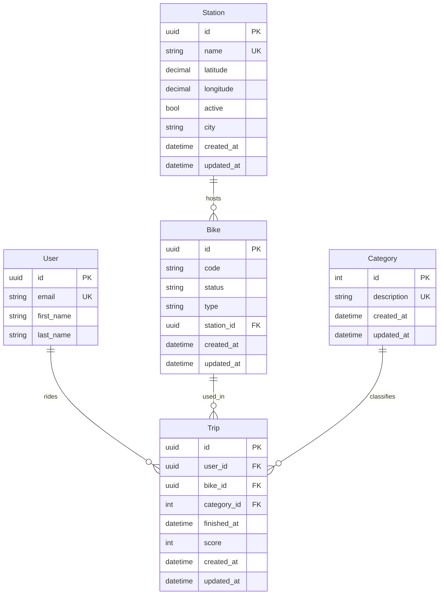
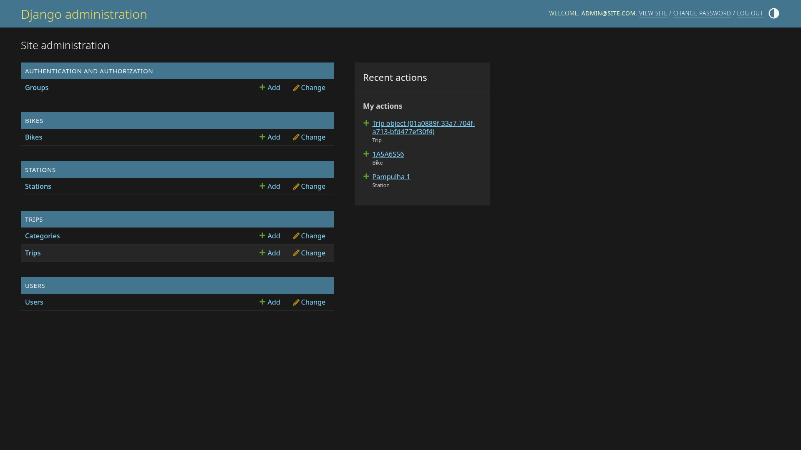
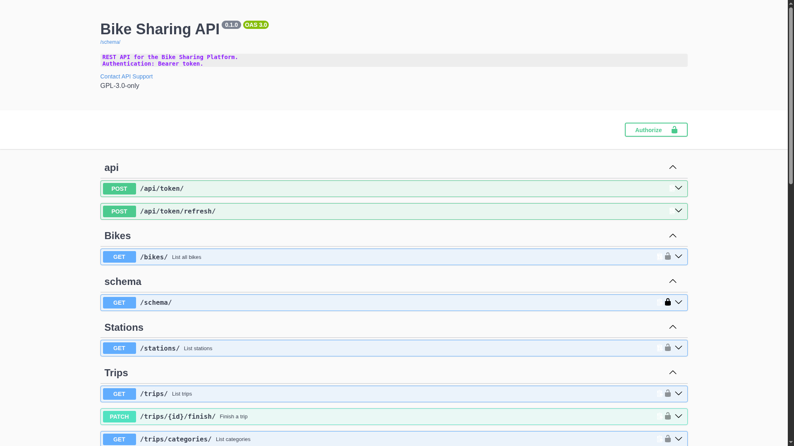
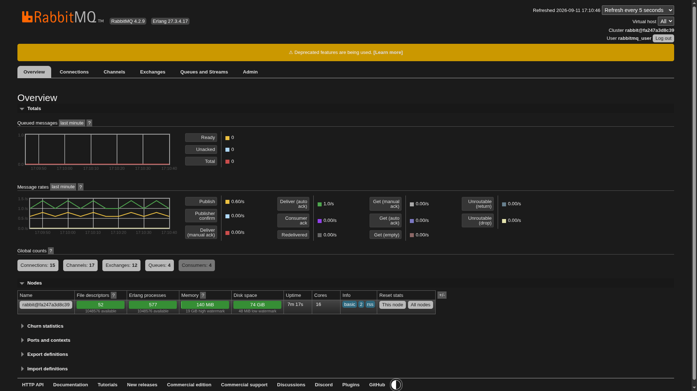
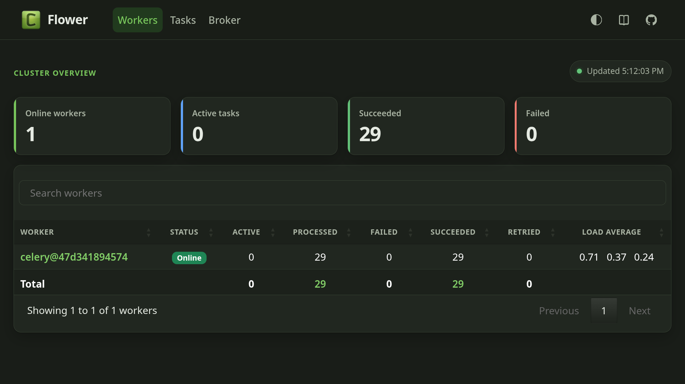

<a id="readme-top"></a>
<!--
*** Thanks for checking out the bike-sharing-platform. If you have a suggestion
*** that would make this better, please fork the repo and create a pull request
*** or simply open an issue with the tag "enhancement".
*** Don't forget to give the project a star!
*** Thanks again! Now go create something AMAZING! :D
-->

<!-- PROJECT SHIELDS -->
<!--
*** I'm using markdown "reference style" links for readability.
*** Reference links are enclosed in brackets [ ] instead of parentheses ( ).
*** See the bottom of this document for the declaration of the reference variables
*** for contributors-url, forks-url, etc. This is an optional, concise syntax you may use.
*** https://www.markdownguide.org/basic-syntax/#reference-style-links
-->
[![Contributors][contributors-shield]][contributors-url]
[![Forks][forks-shield]][forks-url]
[![Stargazers][stars-shield]][stars-url]
[![Issues][issues-shield]][issues-url]
[![GPL-3.0 License][license-shield]][license-url]
[![LinkedIn][linkedin-shield]][linkedin-url]

<!-- PROJECT LOGO -->
<br />
<div align="center">
  <a href="https://github.com/gabrielspires/bike-sharing-platform">
    
  </a>
  <h3 align="center">Bike Sharing Platform</h3>

  <p align="center">
    REST API for urban bike sharing: stations, bikes, riders, and trips.<br />
    JWT auth, OpenAPI docs, and async trip emails with Celery and RabbitMQ.
    <br />
    <a href="#usage">View API</a>
    &middot;
    <a href="https://github.com/gabrielspires/bike-sharing-platform/issues/new?labels=bug&template=bug-report---.md">Report Bug</a>
    &middot;
    <a href="https://github.com/gabrielspires/bike-sharing-platform/issues/new?labels=enhancement&template=feature-request---.md">Request Feature</a>
  </p>
</div>

<!-- TABLE OF CONTENTS -->
<details>
  <summary>Table of Contents</summary>
  <ol>
    <li>
      <a href="#about-the-project">About The Project</a>
      <ul>
        <li><a href="#built-with">Built With</a></li>
      </ul>
    </li>
    <li><a href="#architecture">Architecture</a></li>
    <li>
      <a href="#getting-started">Getting Started</a>
      <ul>
        <li><a href="#prerequisites">Prerequisites</a></li>
        <li><a href="#installation">Installation</a></li>
      </ul>
    </li>
    <li><a href="#usage">Usage</a></li>
    <li><a href="#roadmap">Roadmap</a></li>
    <li><a href="#contributing">Contributing</a></li>
    <li><a href="#license">License</a></li>
    <li><a href="#contact">Contact</a></li>
    <li><a href="#acknowledgments">Acknowledgments</a></li>
  </ol>
</details>

<!-- ABOUT THE PROJECT -->
## About The Project

Bike Sharing Platform is a REST API for a city bike-share network. Admins manage **stations** and **bikes**; riders login via email with JWT authentication and record **trips**. Finishing a trip queues a asynchronous email task so the HTTP request does not wait on SMTP.

The API is made with **Django REST Framework** on **Django 6.1**, documented with **drf-spectacular** (Swagger UI on `/`, ReDoc on `/redoc/`). Identity for both admins and users is a custom email-based user class with **Argon2** password hashing and **SimpleJWT** bearer tokens. Data persistence is handled by **PostgreSQL 17** with connection pooling. Background work runs on **Celery** over **RabbitMQ**, observed with **Flower**. Local infrastructure is defined in Docker Compose. The Django application is also configured to run as a docker container.

Domain apps live under `apps/` and share UUID v7 identifiers plus `created_at` and `updated_at` timestamps via `common.models.BaseModel`. Django Admin is registered for every aggregate so operators can inspect users, stations, bikes, categories, and trips without a custom UI.

### Built With

[![Python][Python]][Python-url]
[![Django][Django]][Django-url]
[![DRF][DRF]][DRF-url]
[![PostgreSQL][PostgreSQL]][PostgreSQL-url] \
[![Celery][Celery]][Celery-url]
[![RabbitMQ][RabbitMQ]][RabbitMQ-url]
[![Docker][Docker]][Docker-url]
[![Poetry][Poetry]][Poetry-url]

| Layer | Technology |
| --- | --- |
| Language / runtime | Python 3.14 |
| Web / API | Django 6.1, Django REST Framework, drf-spectacular |
| Auth | SimpleJWT, Argon2 (`argon2-cffi`), custom `AUTH_USER_MODEL` |
| Database | PostgreSQL 17, `psycopg` with pooling |
| Config | `python-decouple` (`.env`), split settings (`config.settings.base` / `development`) |
| Async | Celery 5, RabbitMQ (AMQP), Flower |
| Tooling | Poetry, Ruff, ty, pre-commit, Factory Boy, Bruno |

<!-- ARCHITECTURE -->
## Architecture

The system is a **modular monolith**: one Django project (`config/`), its bounded-context apps, a shared kernel (`common/`), and an out-of-process worker for background tasks.

```mermaid
flowchart LR
  subgraph Clients
    Swagger["Swagger / ReDoc"]
    Bruno["Bruno collection"]
    AdminUI["Django Admin"]
  end

  subgraph Django["Django 6.1 + DRF"]
    JWT["SimpleJWT"]
    subgraph Apps[Apps]
      Users["apps.users"]
      Stations["apps.stations"]
      Bikes["apps.bikes"]
      Trips["apps.trips"]
    end
    Common["common.BaseModel / BaseUser"]
  end

  subgraph Queue["Asynchronous Distributed Task Queue"]
    Celery["Celery worker"]
    RMQ["RabbitMQ"]
    Flower["Flower"]
  end
  
  subgraph Tasks["Background Tasks"]
    Mail["Trip confirmation email"]
  end
  
  subgraph DB["Database"]
  PG[("PostgreSQL 17")]
  end

  AdminUI --> Users
  Swagger --> JWT
  Bruno --> JWT
  JWT --> Users & Stations & Bikes & Trips
  Users --> Common
  Stations --> Common
  Trips --> Common
  Bikes --> Common
  Bikes --> Stations
  Trips --> Users
  Trips --> Bikes
  Trips -->|"finish_trip.delay"| Celery
  Users & Stations & Bikes & Trips --> PG
  Flower --> RMQ
  Celery --> RMQ
  Celery --> Mail
  Celery --> PG
```



### Domain model



- **User** — email as `USERNAME_FIELD`; staff/superuser flags for Admin and default `IsAdminUser` API policy for security.
- **Station** — unique name, validated WGS84 geo coordinates, optional city name, `active` flag.
- **Bike** — `electric` / `mechanic`; status `available` | `in_use` | `maintenance` | `inactive` | `unknown`; `PROTECT` on station so a dock with fleet cannot be deleted.
- **Category** — trip purpose: work, exercise, leisure, commuting.
- **Trip** — rider + bike + category; optional 1–5 `score`; `finished_at` empty while the ride is open.

Default DRF permission is **admin-only**. Authenticated riders can list categories, list their own trips (`GET /users/trips/`), and finish a trip (`PATCH /trips/<uuid>/finish/`), which sets `finished_at` and enqueues `finish_trip`. That task loads the trip, emails the rider (prints to console in development config), and retries on failure with exponential backoff.

<!-- GETTING STARTED -->
## Getting Started

Run the API, Postgres, RabbitMQ, the Celery worker, and Flower in Docker.

### Prerequisites

- [Python 3.14+](https://www.python.org/downloads/)
- [Poetry](https://python-poetry.org/docs/#installation)
- [Docker](https://docs.docker.com/get-docker/) and Docker Compose (or [Podman](https://podman.io/docs/installation))

> Note: If you choose to use Podman over Docker, just use `podman` instead of `docker` on the terminal commands.

### Installation

1. Clone the repo

   ```sh
   git clone https://github.com/gabrielspires/bike-sharing-platform.git
   cd bike-sharing-platform
   ```

2. Copy environment variables and set `SECRET_KEY` (and credentials if you do not want the example defaults)

   ```sh
   cp .env.example .env
   ```

   `DJANGO_SETTINGS_MODULE` should stay `config.settings.development` for local work. `manage.py` and Celery read it via `python-decouple`.

   If you want to generate a new `SECRET-KEY` value, you can use the following command after you install poetry:

   ```bash
   poetry run python manage.py shell -c "from django.core.management.utils import get_random_secret_key; print(get_random_secret_key())"
   ```

3. Start the application containers

   ```sh
   docker compose up -d --build
   ```

4. Install Python dependencies

   ```sh
   poetry install
   ```

5. Create an operator account

   ```sh
   poetry run python manage.py createsuperuser
   ```

6. Optionally seed users and trips (categories come from migrations)

   ```sh
   poetry run python manage.py seed_data --user-count 10 --trip-count 100
   ```

   Open [http://127.0.0.1:8000/](http://127.0.0.1:8000/) for Swagger. \
   Flower is at [http://127.0.0.1:5555/](http://127.0.0.1:5555/). \
   RabbitMQ management is at [http://127.0.0.1:15672/](http://127.0.0.1:15672/). \
   To see the user/passwords, read the `.env` file.

<!-- USAGE EXAMPLES -->
## Usage

### Authenticate

```sh
curl -X POST http://127.0.0.1:8000/api/token/ \
  -H "Content-Type: application/json" \
  -d '{"email": "you@example.com", "password": "your-password"}'
```

Use the access token as `Authorization: Bearer <token>`. Refresh with `POST /api/token/refresh/`.

### HTTP surface

| Method | Path | Role | Purpose |
| --- | --- | --- | --- |
| GET | `/` | public schema UI | Swagger UI |
| GET | `/schema/` | — | OpenAPI schema |
| GET | `/redoc/` | — | ReDoc |
| POST | `/api/token/` | — | JWT pair |
| POST | `/api/token/refresh/` | — | refresh access token |
| GET | `/users/` | admin | list riders |
| GET | `/users/<uuid>/trips/` | authenticated | list of user's trips |
| GET | `/stations/` | authenticated | list stations |
| GET | `/bikes/` | authenticated | list fleet |
| GET | `/trips/` | authenticated | list all trips (admin sees all trips, users see own trips) |
| GET | `/trips/categories/` | authenticated | list trip categories |
| PATCH | `/trips/<uuid>/finish/` | authenticated owner | end ride and queue email |
| — | `/admin/` | staff | Django Admin |

Pagination is page-number, 10 items per page. Responses are JSON.

The Bruno collection under `.bruno/Bike Sharing API/` is generated from `/schema/` (`baseUrl` `127.0.0.1:8000`). **Import it in Bruno to execute the same requests without writing curl commands.**

## Admin panel

On the admin panel you can execute CRUD operations on all entities. Access it on `127.0.0.1:8000/admin`


## API Docs

To check the API endpoints and their documentation, you can access the Swagger UI on `127.0.0.1:8000`.



## Async task execution monitoring

To monitor the tasks sent to Celery, you can use the RabbitMQ UI and Flower on `127.0.0.1:15672` and `127.0.0.1:5555` respectively:





<!-- ROADMAP -->
## Roadmap

- [x] Domain apps for users, stations, bikes, and trips
- [x] JWT authentication and OpenAPI (Swagger + ReDoc)
- [x] Custom email user, Argon2, UUID v7 base model
- [x] Finish-trip workflow with Celery + RabbitMQ email
- [x] Docker Compose for Postgres, broker, worker, and Flower
- [x] Seed command and Factory Boy factories
- [X] Run the Django API inside Compose, not only the worker
- [ ] Rider checkout: start a trip and transition bike `available` → `in_use`
- [ ] Return-to-station: reassign bike dock and status on finish
- [ ] Finer-grained permissions for public rider vs operator APIs

See the [open issues](https://github.com/gabrielspires/bike-sharing-platform/issues) for a full list of proposed features (and known issues).

<!-- CONTRIBUTING -->
## Contributing

Contributions are what make the open source community such an amazing place to learn, inspire, and create. Any contributions you make are **greatly appreciated**.

If you have a suggestion that would make this better, please fork the repo and create a pull request. You can also simply open an issue with the tag "enhancement".
Don't forget to give the project a star! Thanks again!

1. Fork the Project
2. Create your Feature Branch (`git checkout -b feature/AmazingFeature`)
3. Commit your Changes (`git commit -m 'Add some AmazingFeature'`)
4. Push to the Branch (`git push origin feature/AmazingFeature`)
5. Open a Pull Request

Hooks (Ruff lint/format and `ty check`) run via pre-commit:

```sh
poetry run pre-commit install
```

### Top contributors

<a href="https://github.com/gabrielspires/bike-sharing-platform/graphs/contributors">
  
</a>

<!-- LICENSE -->
## License

Distributed under the GNU General Public License v3.0. See `LICENSE` for more information.

<!-- CONTACT -->
## Contact

Gabriel Pires - [LinkedIn](https://www.linkedin.com/in/--gabriel-pires--) - <gabrielhpires@gmail.com>

<!-- ACKNOWLEDGMENTS -->
## Acknowledgments

- [Django](https://www.djangoproject.com/) and [Django REST Framework](https://www.django-rest-framework.org/)
- [drf-spectacular](https://drf-spectacular.readthedocs.io/)
- [Celery](https://docs.celeryq.dev/) and [Flower](https://flower.readthedocs.io/)
- [SimpleJWT](https://django-rest-framework-simplejwt.readthedocs.io/)
- [Img Shields](https://shields.io)
- [Best-README-Template](https://github.com/othneildrew/Best-README-Template)

<p align="right">(<a href="#readme-top">back to top</a>)</p>

<!-- MARKDOWN LINKS & IMAGES -->
<!-- https://www.markdownguide.org/basic-syntax/#reference-style-links -->
[contributors-shield]: https://img.shields.io/github/contributors/gabrielspires/bike-sharing-platform.svg?style=for-the-badge
[contributors-url]: https://github.com/gabrielspires/bike-sharing-platform/graphs/contributors
[forks-shield]: https://img.shields.io/github/forks/gabrielspires/bike-sharing-platform.svg?style=for-the-badge
[forks-url]: https://github.com/gabrielspires/bike-sharing-platform/network/members
[stars-shield]: https://img.shields.io/github/stars/gabrielspires/bike-sharing-platform.svg?style=for-the-badge
[stars-url]: https://github.com/gabrielspires/bike-sharing-platform/stargazers
[issues-shield]: https://img.shields.io/github/issues/gabrielspires/bike-sharing-platform.svg?style=for-the-badge
[issues-url]: https://github.com/gabrielspires/bike-sharing-platform/issues
[license-shield]: https://img.shields.io/github/license/gabrielspires/bike-sharing-platform.svg?style=for-the-badge
[license-url]: https://github.com/gabrielspires/bike-sharing-platform/blob/main/LICENSE
[linkedin-shield]: https://img.shields.io/badge/-LinkedIn-black.svg?style=for-the-badge&logo=linkedin&colorB=555
[linkedin-url]: https://www.linkedin.com/in/--gabriel-pires--

[Python]: https://img.shields.io/badge/python-3.14-555?style=for-the-badge&logo=python&logoColor=white&labelColor=3776AB
[Python-url]: https://python.org/
[Django]: https://img.shields.io/badge/django-6.1-555?style=for-the-badge&logo=django&logoColor=white&labelColor=0c4b33
[Django-url]: https://www.djangoproject.com/
[DRF]: https://img.shields.io/badge/DRF-3.18-555?style=for-the-badge&logo=django&logoColor=white&labelColor=a30000
[DRF-url]: https://www.django-rest-framework.org/
[PostgreSQL]: https://img.shields.io/badge/postgresql-17-555?style=for-the-badge&logo=postgresql&logoColor=white&labelColor=4169E1
[PostgreSQL-url]: https://www.postgresql.org/
[Celery]: https://img.shields.io/badge/celery-5.6.3-555?style=for-the-badge&logo=celery&logoColor=white&labelColor=37814A
[Celery-url]: https://docs.celeryq.dev/
[RabbitMQ]: https://img.shields.io/badge/rabbitmq-4.2.9-555?style=for-the-badge&logo=rabbitmq&logoColor=white&labelColor=FF6600
[RabbitMQ-url]: https://www.rabbitmq.com/
[Docker]: https://img.shields.io/badge/docker-compose-555?style=for-the-badge&logo=docker&logoColor=white&labelColor=2496ED
[Docker-url]: https://www.docker.com/
[Poetry]: https://img.shields.io/badge/poetry-dependency_mgmt-555?style=for-the-badge&logo=poetry&logoColor=white&labelColor=60A5FA
[Poetry-url]: https://python-poetry.org/
